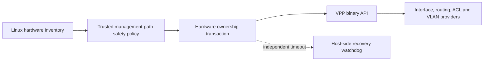

<!-- Copyright 2026 David Cornejo -->
<!-- SPDX-License-Identifier: Apache-2.0 -->

# VPP provider architecture and safety boundary

The VPP provider is Linux-only. It will support both mixed Linux/VPP systems
and, ultimately, machines whose forwarding plane is wholly owned by VPP.
Configuration uses VPP's programmatic API; `vppctl` is diagnostic only.

Physical-device ownership is deliberately separate from ordinary VPP interface
configuration. The `hardware-interface-ownership` resource domain will move an
explicitly allowlisted PCI function between the host and VPP. Interface names
are display metadata, never durable identity. A claim records PCI BDF, expected
MAC address, vendor/device identity, original driver, and desired owner.

The default allowlist is empty. A device is ineligible when it carries the
current management session, an IPv4 or IPv6 default route, or participates in a
management bridge, bond, VLAN parent, or required route. Uncertain identity is
denied. Claiming a device will require a captured host before-image, an
independent recovery watchdog, a surviving management path, and confirmed
commit semantics.

## Current discovery checkpoint

The initial code is read-only and claims no device. On `dev-linux-1` and
`dev-linux-2`, `ens18` maps to PCI `0000:06:12.0`, carries SSH plus IPv4/IPv6
default routes, and is permanently protected. `ens19` maps to PCI
`0000:06:13.0`, uses `virtio_net`, and is the isolated `10.254.254.0/30`
private-LAN candidate. VPP is not installed on either host. No driver, address,
route, or link state was changed while establishing this checkpoint.

The next implementation steps are a programmatic inventory API, an explicit
allowlist model, VPP package/API discovery, and loopback-only transactions
before any physical-device ownership work.
