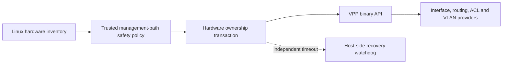

<!-- Copyright 2026 David Cornejo -->
<!-- SPDX-License-Identifier: Apache-2.0 -->

# VPP provider architecture and safety boundary

The VPP provider is Linux-only. It will support both mixed Linux/VPP systems
and, ultimately, machines whose forwarding plane is wholly owned by VPP.
Configuration uses VPP's programmatic API; `vppctl` is diagnostic only.

Physical-device ownership is deliberately separate from ordinary VPP interface
configuration. The `hardware-interface-ownership` resource domain will move an
explicitly allowlisted PCI function between the host and VPP. Interface names
are display metadata, never durable identity. The initial
`dang-vpp-interface-ownership` model identifies a claim with its PCI BDF and
pins the expected MAC and PCI vendor/device values. The original driver is
captured from live inventory for the eventual reversible transaction rather
than trusted as client-supplied policy.



The default allowlist is empty: an absent ownership subtree requests no VPP
transfer, and each listed device defaults to owner `host`. Before accepting
owner `vpp`, the policy evaluator compares the configured PCI BDF, MAC address,
and vendor/device pair with a fresh inventory. A missing device, identity
drift, default-route evidence, management-session evidence, or uncertain
eligibility fails closed with the affected YANG path. A future transfer must
also reject bridge, bond, VLAN-parent, and required-route participation.
Claiming a device will require a captured host before-image, an independent
recovery watchdog, a surviving management path, and confirmed-commit
semantics.

## Current discovery checkpoint

The current code is read-only and claims no device. On `dev-linux-1` and
`dev-linux-2`, `ens18` maps to PCI `0000:06:12.0`, carries SSH plus IPv4/IPv6
default routes, and is permanently protected. `ens19` maps to PCI
`0000:06:13.0`, uses `virtio_net` with PCI identity `1af4:1000`, and is the
isolated `10.254.254.0/30` private-LAN candidate. The inventory and ownership
policy tests pass on both hosts; the policy tests cover exact identity,
identity drift, unknown PCI functions, protected management paths, and explicit
host ownership. VPP is not installed on either host. No driver, address, route,
or link state was changed while establishing this checkpoint.

The model and evaluator are a validation-only scaffold and are not yet exposed
by a loadable dangd plugin. Bridge, bond, VLAN-parent, and required-route
evidence plus the recovery watchdog remain prerequisites for physical claims.

The provider has a narrow C++ client seam for VPP loopback creation,
administrative state, and deletion. Its API-only transaction retains the VPP
software index, restores absence on rollback, immediately compensates a failed
administrative-up request, and preserves the handle for later recovery if that
compensation fails. The production implementation uses FD.io's generated C++
VAPI messages for `create_loopback`, `sw_interface_set_flags`, and
`delete_loopback`; it checks message availability and waits for the correlated
reply before reading it. The client uses VPP's Unix-domain-socket binary API so
an absent daemon fails promptly and stale shared-memory segments cannot hang a
worker. Focused tests use an in-memory client, while the live probe performs the
same complete lifecycle against a real daemon.

The `dang-vpp-interfaces` model now provides deterministic software-loopback
intent. Each entry is keyed by VPP's persistent user instance, yielding native
name `loopN`; `sw_if_index` remains only the live mutation handle. The snapshot
planner emits all creates before activation, and deactivates an enabled
loopback before deletion. This ordering is covered independently of the daemon
and is surfaced through one ABI-v7 hardware action.

When VAPI development files are present, `dangd_vpp_plugin.so` exposes both VPP
models through ABI v7 and claims the `vpp-software-interfaces` and
`hardware-interface-ownership` resource domains. It applies the complete
software-interface plan as one compensated coordinator action and resolves
pre-existing `loopN` objects from a fresh VPP interface dump, so restart does
not depend on cached software indexes. Physical `owner vpp` requests remain
explicitly rejected after live identity and management-path validation; the
model is visible for forward compatibility, not an unsafe claim of support.

## VAPI build and isolated validation

The optional VAPI target is enabled when CMake finds `vapi/vapi.hpp` and
`libvapiclient`. For a supported FD.io installation, install matching versions
of `vpp`, `vpp-dev`, `libvppinfra`, and `libvppinfra-dev`; `vpp-plugin-core` is
needed when later providers use functionality outside VPP's core. Configure the
repository normally and build `vpp-vapi-loopback-check`. Pass its optional first
argument as the VPP binary API socket; the default is `/run/vpp/api.sock`.

`tests/vpp-isolated-startup.conf` is the safe live-test profile. It disables all
external plugins (including PCI drivers), uses a private API segment, and puts
its binary API socket, CLI, statistics socket, runtime data, and log below
`/tmp/dang-vpp-run`. Start a disposable VPP with that profile, run
`vpp-vapi-loopback-check /tmp/dang-vpp-run/api.sock`, and always terminate that
exact daemon process afterward. A successful interaction is:

```text
created and enabled loop0
restored pre-test state
```

Both test hosts currently run Ubuntu 26.04. FD.io's release repository publishes
VPP 26.06 packages for Ubuntu 24.04 and Debian 12, but not Ubuntu 26.04. No
unsupported repository or mismatched package was installed. For compatibility
testing only, the matching Ubuntu 24.04 packages were downloaded, unpacked
below `/tmp/dang-vpp-2606`, and loaded without modifying the package database.
On both hosts the adapter built warning-clean, the three portable VPP tests
passed, and an isolated daemon completed and reversed the live loopback
lifecycle. This is useful interoperability evidence, but it does not make the
unpublished Ubuntu 26.04 package combination a supported deployment.
