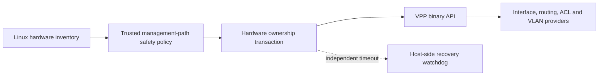

<!-- Copyright 2026 David Cornejo -->
<!-- SPDX-License-Identifier: Apache-2.0 -->

# VPP provider architecture and safety boundary

The VPP provider is Linux-only. It will support both mixed Linux/VPP systems
and, ultimately, machines whose forwarding plane is wholly owned by VPP.
Configuration uses VPP's programmatic API; `vppctl` is diagnostic only.

Physical-device ownership is deliberately separate from ordinary VPP interface
configuration. The `hardware-interface-ownership` resource domain will move an
explicitly allowlisted PCI function between the host and VPP. Interface names
are display metadata, never durable identity. The initial
`dang-vpp-interface-ownership` model identifies a claim with its PCI BDF and
pins the expected MAC and PCI vendor/device values. The original driver is
captured from live inventory for the eventual reversible transaction rather
than trusted as client-supplied policy.

The default allowlist is empty: an absent ownership subtree requests no VPP
transfer, and each listed device defaults to owner `host`. Before accepting
owner `vpp`, the policy evaluator compares the configured PCI BDF, MAC address,
and vendor/device pair with a fresh inventory. A missing device, identity
drift, default-route evidence, management-session evidence, or uncertain
eligibility fails closed with the affected YANG path. A future transfer must
also reject bridge, bond, VLAN-parent, and required-route participation.
Claiming a device will require a captured host before-image, an independent
recovery watchdog, a surviving management path, and confirmed-commit
semantics.

## Current discovery checkpoint

The current code is read-only and claims no device. On `dev-linux-1` and
`dev-linux-2`, `ens18` maps to PCI `0000:06:12.0`, carries SSH plus IPv4/IPv6
default routes, and is permanently protected. `ens19` maps to PCI
`0000:06:13.0`, uses `virtio_net` with PCI identity `1af4:1000`, and is the
isolated `10.254.254.0/30` private-LAN candidate. The inventory and ownership
policy tests pass on both hosts; the policy tests cover exact identity,
identity drift, unknown PCI functions, protected management paths, and explicit
host ownership. VPP is not installed on either host. No driver, address, route,
or link state was changed while establishing this checkpoint.

The model and evaluator are a validation-only scaffold and are not yet exposed
by a loadable dangd plugin. The next implementation steps are VPP package and
binary-API discovery, then VPP-created loopback transactions before any
physical-device ownership work. Bridge, bond, VLAN-parent, and required-route
evidence plus the recovery watchdog remain prerequisites for physical claims.

The provider now also has a narrow C++ client seam for VPP loopback creation,
administrative state, and deletion. Its API-only transaction retains the VPP
software index, restores absence on rollback, immediately compensates a failed
administrative-up request, and preserves the handle for later recovery if that
compensation fails. Focused tests use an in-memory client; they do not pretend
to establish daemon interoperability.

Both test hosts currently run Ubuntu 26.04. FD.io's release repository publishes
VPP 26.06 packages for Ubuntu 24.04 and Debian 12, but not Ubuntu 26.04. No
unsupported repository or mismatched package was installed. Production code
will target the generated C++ VAPI headers from `vpp-dev`; live loopback
validation needs either an officially supported test OS or an isolated build
whose complete dependencies and runtime are kept outside the host package
database.
